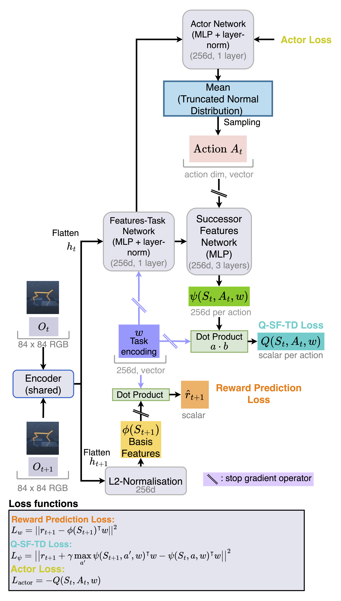
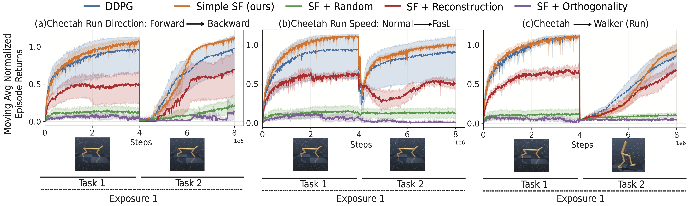

# Learning Successor Features the Simple Way 
This is the official code for our paper, ["Learning Successor Features the Simple Way,"](https://arxiv.org/abs/2410.22133) accepted at NeurIPS 2024. 

The authors are Raymond Chua, Arna Ghosh, Christos Kaplanis, Blake Richards and Doina Precup.

## TLDR: A simple and elegant approach to learning Successor Features 🌟

## Introduction
Deep Reinforcement Learning (RL) plays a crucial role in enabling intelligent systems to adapt and generalize across 
diverse and changing environments. However, a fundamental challenge in RL is learning representations that are robust to 
forgetting and interference, particularly in continual learning settings.

Successor Features (SFs) offer a promising approach to mitigating these issues by decoupling representations from reward 
functions. Despite their theoretical advantages, learning SFs from high-dimensional inputs (e.g., pixels) remains difficult, 
often leading to representation collapse, where learned features fail to encode meaningful information.

In our **NeurIPS 2024 paper**, we introduce Simple Successor Features (Simple SFs)—a streamlined, efficient method to learn 
SFs directly from pixels, without requiring: 

1. Pre-training
2. Complex auxiliary losses such as reconstruction

## Key Contributions
- A simple yet effective modification of the Temporal-Difference (TD) loss, enabling stable SF learning from high-dimensional inputs.
- Empirical validation across various environments, demonstrating superior performance in:
  1. 2D and 3D navigation tasks
  2. Mujoco continuous control tasks
  3. Continual RL settings, where SFs reduce interference and improve transferability.
- Implementation in both PyTorch (Continuous Actions) and JAX (Discrete Actions).

## What’s in this Repository?
This repo provides the official implementation of **Simple SFs**, including:
- PyTorch implementation for continuous action environments (adapted from the [Unsupervised Reinforcement Learning Benchmark (URLB) repository](https://github.com/rll-research/url_benchmark).
- JAX (Flax) implementation for discrete action environments (coming soon!)

## Quickstart Guide 
This section provides a step-by-step guide to getting started with **Simple Successor Features (Simple SFs)**.

### 1. Setting Up the Environment
We recommend using **Conda** for dependency management. To set up the environment, run:
```bash
conda env create -f conda_env.yml
conda activate simple_sfs
```

### 2. Training Simple SFs
Once the environment is set up, start the training by running:
```bash
python full_train.python
```

### 3. Modifying Training Parameters
The configuration file full_train.yaml controls training parameters such as num_train_frames etc. 
To log and visualize training progress, set use_wandb to True. 

## Architecture & Experimental Results
The following figures illustrates the architecture of **Simple SFs** and the experimental results for the Mujoco environments. 

The architecture of **Simple SFs** follows an **actor-critic structure** for continuous actions:

<p align="center">
  
</p>

The experimental results for the Mujoco environments demonstrate the superior performance of **Simple SFs** compared to the baseline methods:

<p align="center">
  
</p>


## Structure
***
The repository is structured as follows:

| Folder           |          Description          |
|:-----------------|:-----------------------------:|
| agent            | Implementations of the agents | 
| custom_dmc_tasks |             Tasks             |


## Implementation Details
| Environment Type       |           Framework            |             Status              |
|:-----------------------|:------------------------------:|:-------------------------------:|
| Continuous Actions     |            PyTorch             |            ✅ Available          |  
| Discrete Actions       |           JAX (Flax)           | 🔄 Migrating from Haiku to Flax |


## Citations
***
If you find this repository useful in your research, please consider citing our paper:

```bibtex
@inproceedings{NEURIPS2024_597254dc,
 author = {Chua, Raymond and Ghosh, Arna and Kaplanis, Christos and Richards, Blake and Precup, Doina},
 booktitle = {Advances in Neural Information Processing Systems},
 editor = {A. Globerson and L. Mackey and D. Belgrave and A. Fan and U. Paquet and J. Tomczak and C. Zhang},
 pages = {49957--50030},
 publisher = {Curran Associates, Inc.},
 title = {Learning Successor Features the Simple Way},
 url = {https://proceedings.neurips.cc/paper_files/paper/2024/file/597254dc45be8c166d3ccf0ba2d56325-Paper-Conference.pdf},
 volume = {37},
 year = {2024}
}
```


